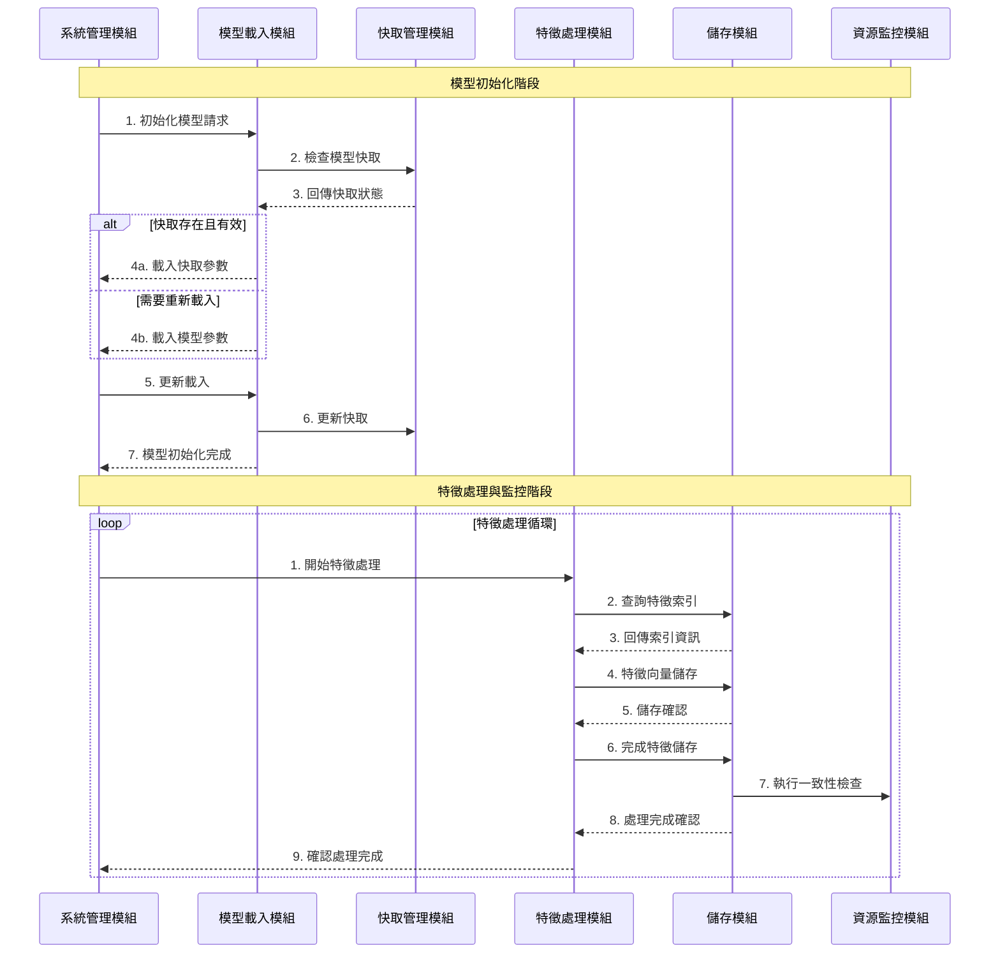

# Pairon
本專案為個人碩論[整合深度學習與多重特徵提取之人物辨識及全身追蹤系統](https://hdl.handle.net/11296/8ytxzm)的後端實作部分，基於視覺基礎模型(vision foundation model)進行零樣本(Zero-shot)的人物辨識與追蹤系統。

## 專案概述
Pairon 是一套整合深度學習與多重特徵提取的人物辨識及全身追蹤系統。 本系統突破傳統人臉辨識的限制，能夠對有遮擋或不完整的人臉擷取特徵，並透過零樣本學習實現各種情況下的人臉特徵辨識，進而將辨識到的人物進行持續追蹤。

## 專案流程

### 範例影片

## 辨識效能

### 資料集
- 使用 **Market-1501** 與**Market-1501 Attribute** 資料集進行實驗，並結合其附帶的屬性標註進行人物屬性辨識評估，遮擋情境追蹤為利用自行設計的影像資料進行實驗。

### 人物辨識性能
- **Rank-1 準確率**：92.99%
- **Rank-5 準確率**：97.18%
- **Rank-10 準確率**：97.80%

### 人物屬性辨識
- 配件與服裝顏色辨識準確率均超過 95%

### 遮擋情境追蹤
- 系統成功應對九種不同類型的遮擋情境（例如動態人群遮擋、機車交會等），在追蹤穩定性上顯著超越傳統方法（如 ByteTrack 與 BoT-SORT）。

## 環境需求

本系統需要以下模型檔案才能正常運行：
- GFPGAN 模型檔：用於人臉修復與增強
  - 下載位置：[GFPGAN Model](https://drive.google.com/drive/folders/1AspP1c836z_abNLn1REQNvXQvnQ43zBR?usp=sharing)
  - 將下載的模型放入根目錄下
